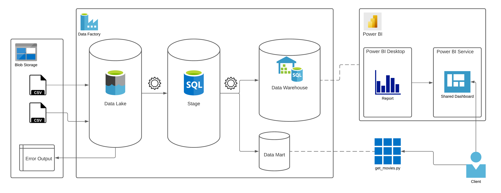
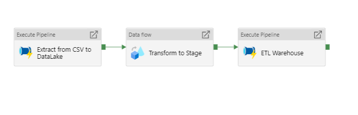
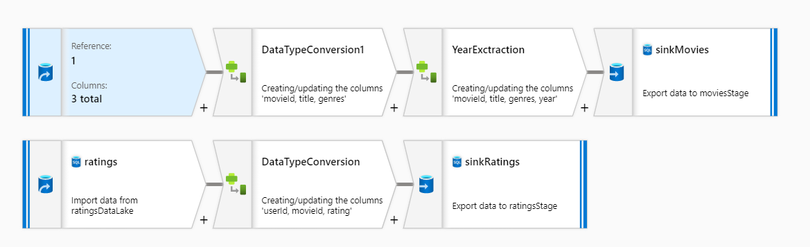
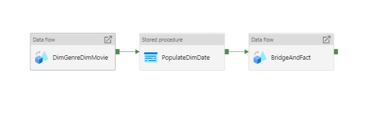
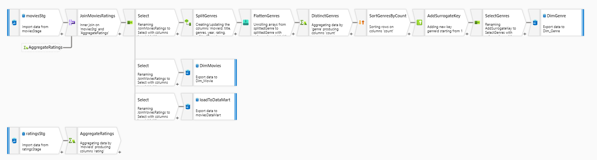
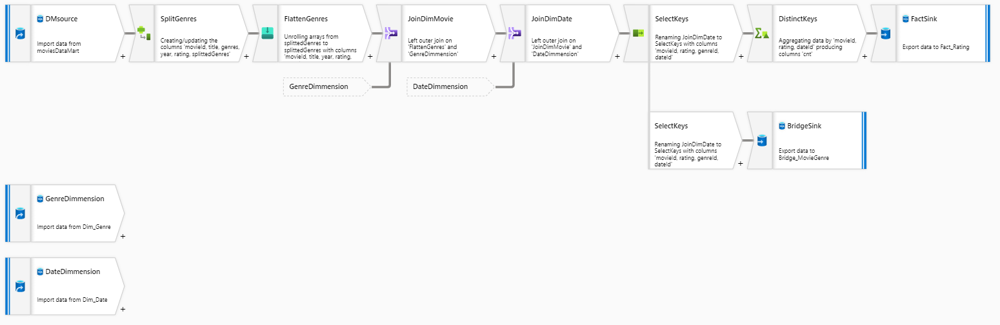
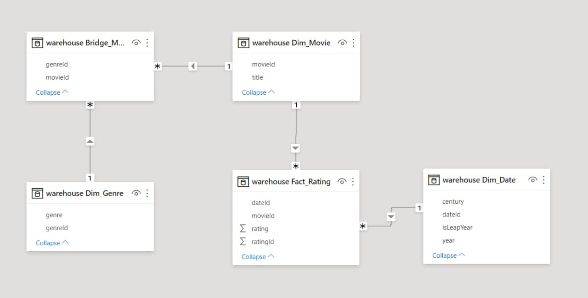
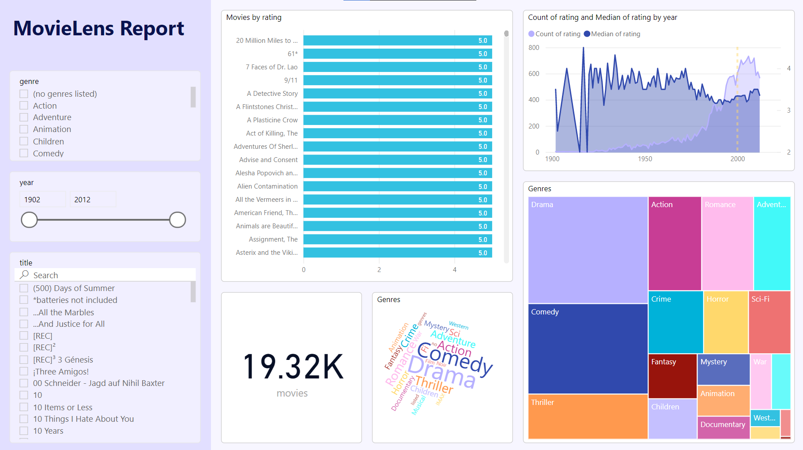

# MovieLens Microsoft Azure Data Warehouse

## Architecture Diagram

## Azure Data Factory
### Main Pipeline

### Stage Data FLow (Transform to Stage)

### Data Warehouse Pipeline (ETL Warehouse)

### Warehouse Data FLow (DimGenreDimMovie)

### Warehouse Fact Data FLow (BridgeAndFact)

## Azure SQL Database
### Warehouse Diagram

## Power BI
### Report

